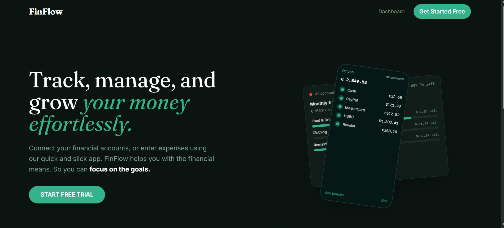

# FinFlow — Personal Finance Dashboard

A modern, responsive Finance Dashboard Web App built using React.js + TypeScript + Context API, designed to help users track, analyze, and understand their financial activity with clean UI, insightful analytics, and smooth user experience.

🚀 Live Demo
https://finance-flow-xi-sable.vercel.app/

## Project Structure

```
src/
├── components/     # Reusable UI components (AppShell, NavLink, shadcn/ui)
├── context/        # AppContext for global state & role management
├── data/           # Mock data for dashboard, transactions, goals
├── hooks/          # Custom hooks (use-mobile, use-toast)
├── pages/          # Route pages (Dashboard, Transactions, Reports, etc.)
├── assets/         # Static assets
└── lib/            # Utility functions
```

## Tech Stack

- **React 18** + **TypeScript 5**
- **Vite 5** — Dev server & bundler
- **Tailwind CSS 3** — Utility-first styling
- **shadcn/ui** — Accessible component primitives
- **Recharts** — Charts & data visualisation
- **React Router 6** — Client-side routing
- **React Context** — Global state management
  

## Features

📌 Features
🏠 Landing Page
Beautiful fintech-style hero section
Call-to-action to access dashboard
Clean and minimal UI with gradient aesthetics
📊 Dashboard Overview
Summary cards:
Total Balance
Income
Expenses
Mini visual indicators and trends
Fully responsive layout
📈 Analytics & Visualizations
Line Chart → Balance trend over time
Bar Chart → Income vs Expenses
Donut Chart → Spending breakdown
Sankey Diagram → Cash flow visualization (Income → Expenses → Savings)
📋 Transactions Management
View all transactions with:
Date, Amount, Category, Type
Features:
Search
Filtering (category/type)
Sorting (date/amount)
🎯 Goals Section (New Feature)

Users can define and track financial goals.

Features:
Add goals (e.g., “Save ₹50,000 for Travel”)
Track progress with progress bars
Set deadlines or target amounts
Visual indicators:
Completed goals
In-progress goals
Insights like:
“You are 70% towards your savings goal”
👤 Role-Based UI (Frontend Simulation)
Switch between:
Admin
Viewer
Permissions:
Admin:
Add / Edit / Delete transactions
Add/Edit goals
Viewer:
Read-only access
🙍 Profile Popover
Clickable avatar in navbar
Shows:
Profile image
Name & Email
Role badge
Logout option
Dynamic data based on selected role
💡 Insights Section

Smart, data-driven insights including:

Highest spending category
Monthly comparison
Spending trends
Budget usage warnings
Most expensive day/week
Frequent categories
Savings analysis
Income vs expense ratio
Recurring expenses
Smart financial suggestions
📊 Advanced Analytics
Cash flow analysis
Daily/weekly spending patterns
Budget vs actual comparison
Recurring vs one-time expenses
Transaction size distribution
Savings rate trends
Anomaly detection
✨ UI & UX
Soft gradient theme (pink → purple → dark indigo)
Light & Dark mode support
Glassmorphism effects
Smooth animations:
Hover effects
Page transitions
Popover animations
Fully responsive design


## Prerequisites

- **Node.js** ≥ 18

## Run Locally (VS Code)

```bash
# 1. Clone the repo
git clone <your-repo-url>
cd finflow

# 2. Install dependencies
npm install

# 3. Start the dev server
npm run dev
```

The app will be available at `http://localhost:8080`.

### Useful Scripts

| Command | Description |
|---------|-------------|
| `npm run dev` | Start dev server with HMR |
| `npm run build` | Production build to `dist/` |
| `npm run preview` | Preview the production build |
| `npm run lint` | Run ESLint |

## Deploy to Vercel

### Option A — Via Vercel Dashboard

1. Push your code to GitHub.
2. Go to [vercel.com/new](https://vercel.com/new) and import the repository.
3. Vercel auto-detects **Vite** — no config changes needed.
4. Click **Deploy**. Your app will be live in ~60 seconds.


### Environment Variables

No environment variables are required for the default setup. If you add backend integrations later, configure them in the Vercel dashboard under **Settings → Environment Variables**.

## 📸 Screenshots

<h3>🏠 Landing Page</h3>


<h3>📊 Dashboard</h3>


📄 License

This project is for educational and evaluation purposes.

⭐ If you like this project

Give it a star on GitHub ⭐
